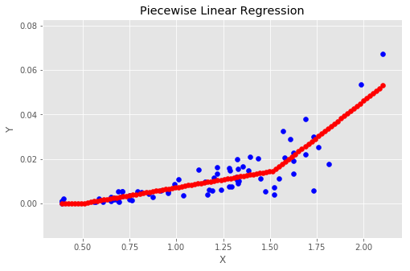
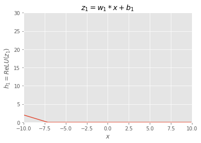
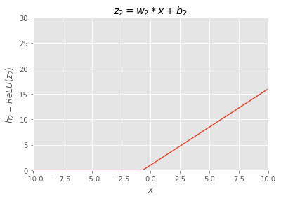
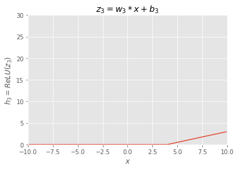
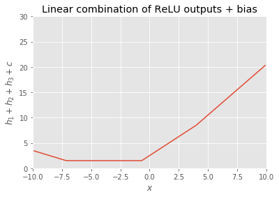
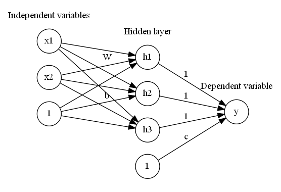
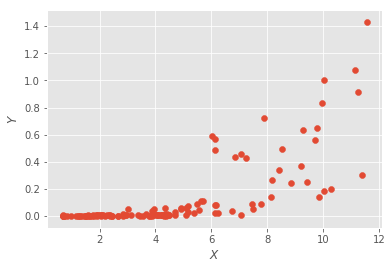
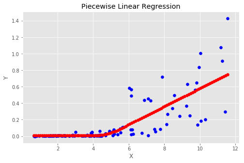

# Piecewise Linear Regression




## Motivation

 Relationships that can be explained by linear regression are limited in practice. Polynomial or other complex machine learning models are hard to explain, and could behave extreme outside of the data range. Piecewise linear regression, with flexible number of segments and break points may work when linear regression is too simple but patches of linear regression could express the phases of the relationship.

Some examples of piecewise linear regression applications are linked below:

- [A Tutorial on the Piecewise Regression Approach Applied to Bedload Transport Data](https://www.fs.fed.us/rm/pubs/rmrs_gtr189.pdf)
- [Water-cement ration v.s. compressive strength](https://onlinecourses.science.psu.edu/stat501/node/310/)
- [Piecewise Linear Regression: A Statistical Method for the Analysis of the Relationship between Traffic Signal Parameters and Air Pollutant Emissions](http://atrf.info/papers/2016/files/ATRF2016_Full_papers_resubmission_64.pdf)

## Previous works

[1] [A Tutorial on the Piecewise Regression Approach Applied to Bedload Transport Data](https://www.fs.fed.us/rm/pubs/rmrs_gtr189.pdf)
- Break point estimates need to be provided by user
- Use of SAS NLIN, Nonlinear least squares regression

[2] [segmented: An R Package to Fit Regression Models with Broken-Line Relationships](https://www.researchgate.net/publication/234092680_Segmented_An_R_Package_to_Fit_Regression_Models_With_Broken-Line_Relationships)

- Break point estimates need to be provided by user
- Iterative linear regression

[3] [A Learning Algorithm for Piecewise Linear Regression](https://pdfs.semanticscholar.org/7345/d357145bc19701397cb894d22e28f770513e.pdf)

- Clustering and regression. Multi-variables. The line may be disconnected.
- Separate gate for each hidden node.


##  Proposed method - Neural network application

### Developping an intuition

Can you imagine adding up following functions ($h_1+h_2+h_3$)?


```python
import numpy as np
import matplotlib.pyplot as plt
%matplotlib inline
plt.style.use('ggplot')

def ReLU(x):
    y = np.maximum(0, x)
    return y

def plothi(w,b,i):
    x = np.arange(-10, 10, 0.1)
    z = w*x+b
    h = ReLU(z)
    plt.plot(x,h)
    plt.xlim(-10, 10)
    plt.ylim(0, 30)
    plt.xlabel('$x$')
    plt.ylabel('$h_{}=ReLU(z_{})$'.format(i,i))
    plt.title('$z_{}=w_{}*x+b_{}$'.format(i,i,i))
    plt.grid(True)
    plt.show()

# hidden note 1 output
i = 1 
b = -5
w = -0.7
plothi(w,b,i)

# hidden note 2 output
i = 2
b = 1
w = 1.5
plothi(w,b,i)

# hidden note 3 output
i = 3
b = -2
w = 0.5
plothi(w,b,i)
```











Answer:


```python
x = np.arange(-10, 10, 0.1)

b = -5
w = -0.7
h1 = ReLU(w*x+b)

b = 1
w = 1.5
h2 = ReLU(w*x+b)

b = -2
w = 0.5
h3 = ReLU(w*x+b)

c = 1.5


plt.plot(x,h1+h2+h3+c)
plt.xlim(-10, 10)
plt.ylim(0, 30)
plt.xlabel('$x$')
plt.ylabel('$h_1+h_2+h_3+c$')
plt.title('Linear combination of ReLU outputs + bias')
plt.grid(True)
plt.show()

```





### Conclusion

Linear combination of ReLU outputs + bias becomes connected lines.
In multi-dimention $x=(x_1,x_2,..)$, it becomes connected hyperplane.


### Graphical explanation



 Let me use the diagram above to explain the idea. This is 2 variables ($x_1$, $x_2$) example, but you can increase number of variables. 
 The first layer represents independent variables, or input layers. The bottom node is constant 1 and is expressing bias with edges to the hidden layers.
 
 The 2nd layer is hidden layer, and in this case we have 3 nodes $h_1$, $h_2$, and $h_3$. This is equal to the number of potential segments-1. In this case above, we designed to create 4 segments at most. Input to the $h_1$ is $w_{11}*x_1+w_{21}*x_2+b_1$. Output of hidden node is the result of ReLU activation. The output layer node $y$ is just some of hidden layer outputs plus bias $c$.
 
  The error between $y$ and actual observation $\bar{y}$ will create a loss function and we optimize $W$ , $b$ and $c$ to reduce the loss. We also apply L1 regularization on weights to regulate the number of segments. L1 regularization tends to force weights to 0 if the corresponding variable does not have much impact.
  
 The benefit of this neural network optimization method is that we can avoid the manual input like initial breakpoints estimate or number of segment, and let the data decide. In comparison with [3], it is quite similar idea, but this model is much simple. The gate mentioned in the [3] corresponds to ReLU with no separate parameters here, and there's no clustering etc. It's just summing up output of ReLU.

### Methematical explanation

 For those prefer mathematical explanation, here's the formula:

$$
y = (1,...,1) (W^Tx+b)^+ +c
$$

Here, $y$ is a dependent variable. $x$ is independent variables. It is a column vector with different variables in row direction. $W$ contains slopes of different input variables in the row direction and the hidden nodes in the column direction. The result of $W^Tx$ places hidden nodes in row direction. The bias $b$ is a column vector with a bias for each hidden nodes in row direction. Let me provide more concrete example. The $i$th row of $W^Tx+b$ is an input to a hidden node $h_i$, say $z_i$. The $z_i$ for 2 variables input $x = [x_1, x_2]^T$ can be written as 
$$
z_i = \begin{bmatrix}
w_{1i}\\ 
w_{2i}
\end{bmatrix}^T  \begin{bmatrix}
x_1\\ 
x_2
\end{bmatrix} + b_i = w_{1i}*x_1+w_{2i}*x_2+b_i
$$
Here, $w_{1i}$ and $w_{2i}$ are slopes for $x_1$ and $x_2$ in segment $i$ respectively. $b_i$ is a bias. 

The $(.)^+$ represent ReLU  or $max\{0, . \} $.  Finally, applying (1,...,1) just means adding up all the rows, in other words, the outputs of all the hidden nodes plus bias $c$.

By adding 1 on the last row on $x$,  and adding $b$ on the last row on $W$, the formula can be written as
$$
y = (1,...,1) (W^Tx)^+ +c
$$


## Getting data

If you clone the git repository, you will get the data. 
If you want to download by yourself, follow the instruction below.

Get sample data from [here](https://www.fs.usda.gov/rds/archive/Product/RDS-2007-0004). Download the zip file, and extract on the working directory. You should have ./RDS-2007-0004.


## Import sample data


```python
"""
import sample data
"""
import pandas as pd
import numpy as np
import matplotlib.pyplot as plt

#data = pd.read_csv("RDS-2007-0004\Data\HAYDEN_bedloadtransport.csv",skiprows=7)
data = pd.read_csv("RDS-2007-0004\Data\LTLGRAN_bedloadtransport.csv",skiprows=7)
data.head()
```


<div>
<style scoped>
    .dataframe tbody tr th:only-of-type {
        vertical-align: middle;
    }

    .dataframe tbody tr th {
        vertical-align: top;
    }

    .dataframe thead th {
        text-align: right;
    }
</style>
<table border="1" class="dataframe">
  <thead>
    <tr style="text-align: right;">
      <th></th>
      <th>Date</th>
      <th>Year</th>
      <th>X</th>
      <th>Y</th>
    </tr>
  </thead>
  <tbody>
    <tr>
      <th>0</th>
      <td>05/08/85</td>
      <td>1985</td>
      <td>3.936450</td>
      <td>0.049770</td>
    </tr>
    <tr>
      <th>1</th>
      <td>05/15/85</td>
      <td>1985</td>
      <td>2.945258</td>
      <td>0.009324</td>
    </tr>
    <tr>
      <th>2</th>
      <td>05/25/85</td>
      <td>1985</td>
      <td>3.653253</td>
      <td>0.016485</td>
    </tr>
    <tr>
      <th>3</th>
      <td>05/30/85</td>
      <td>1985</td>
      <td>2.831979</td>
      <td>0.013104</td>
    </tr>
    <tr>
      <th>4</th>
      <td>06/05/85</td>
      <td>1985</td>
      <td>1.925746</td>
      <td>0.003601</td>
    </tr>
  </tbody>
</table>
</div>


```python
data.info()
```

    <class 'pandas.core.frame.DataFrame'>
    RangeIndex: 123 entries, 0 to 122
    Data columns (total 4 columns):
    Date    123 non-null object
    Year    123 non-null int64
    X       123 non-null float64
    Y       123 non-null float64
    dtypes: float64(2), int64(1), object(1)
    memory usage: 3.9+ KB
    


```python
plt.scatter(data['X'],data['Y'])
plt.xlabel('$X$')
plt.ylabel('$Y$')
plt.show()
```





### Model implementation with TF

For this specific method, it is not quite computationaly heavy. You may be able to use and CPU and any library if it works.

Tensorflow is the most popular library when it comes to nueral network and it scales well on GPUs.
It also allow you to do the stuff you want with flexibility. When your logic is not standard vanila methods, things begome difficult with higher level library like Keras. 

So why not Tensorflow. It works.
By the way, you can use Tensorflow with R.

First, check your device.


```python
from tensorflow.python.client import device_lib
device_lib.list_local_devices() 
```


    [name: "/cpu:0"
     device_type: "CPU"
     memory_limit: 268435456
     locality {
     }
     incarnation: 13170657934810058474, name: "/gpu:0"
     device_type: "GPU"
     memory_limit: 6753009500
     locality {
       bus_id: 1
     }
     incarnation: 16298767861173171011
     physical_device_desc: "device: 0, name: GeForce GTX 1070, pci bus id: 0000:01:00.0"]


The key of TF implementation is to understand computation graph, session , operation and palceholder.


```python
import tensorflow as tf
from sklearn import linear_model

"""
parameters
"""
sample_rate = 1.0 # rondom sampling rate for each batch. 
#It does not have much capacity and probably not much worry about overfitting. 1.0 should be fine.
epoc = 500
input_dim = 1 # number of input dimention(variables)
h1_dim = 3 # potential number of segments-1
lamda = 0.0001 # L1 reglurarization
lr=0.001 #learning rate

"""
fromatting numpy array
"""
X = np.array(data.X).reshape(-1,input_dim)
Y = np.array(data.Y).reshape(-1,1)


"""
Util functions
"""
# next batch from stack overflow
def next_batch(rate, data, labels):
    '''
    Return a total of `num` random samples and labels. 
    '''
    idx = np.arange(0 , len(data))
    np.random.shuffle(idx)
    idx = idx[: int(len(data)*rate)]
    data_shuffle = [data[ i] for i in idx]
    labels_shuffle = [labels[ i] for i in idx]

    return np.asarray(data_shuffle), np.asarray(labels_shuffle)

"""
helping search with a good initial values
"""
lreg = linear_model.LinearRegression()
lreg.fit(X, Y)

"""
tensorflow graph
"""
# reset graph
tf.reset_default_graph()

# Placeholders for input data and the targets
x_ph  = tf.placeholder(dtype=tf.float32, shape=[None, input_dim], name='Input')
y_ph = tf.placeholder(dtype=tf.float32, shape=[None,1], name='Output')

w = tf.get_variable("weight", shape=[input_dim,h1_dim],
                    initializer=tf.random_normal_initializer(mean=lreg.coef_[0][0]/h1_dim,stddev=0.001))
b = tf.get_variable('bias1', shape = [1,h1_dim],
                    initializer=tf.random_normal_initializer(mean=lreg.intercept_[0]/h1_dim, stddev=0.001))
c = tf.get_variable('bias2', shape = [1,1],
                    initializer=tf.random_normal_initializer(mean=0, stddev=0.001))

h = tf.nn.relu(tf.add(tf.matmul(x_ph, w),b))
y = tf.reduce_sum(h, axis = 1)+c

L1 = tf.reduce_sum(tf.abs(w))
loss = tf.losses.mean_squared_error(y_ph, tf.reshape(y,(-1,1)))+lamda*L1
opt = tf.train.AdamOptimizer(learning_rate = lr).minimize(loss)

init = tf.global_variables_initializer()

"""
training
"""
with tf.Session() as sess:  
    sess.run(init)
    for i in range(epoc):
        print("------------------Epoch {}/{} ------------------".format(i, epoc))
        batch_x, batch_y = next_batch(sample_rate,X,Y)            
        _, loss_val = sess.run([opt,loss],feed_dict={x_ph:batch_x ,y_ph:batch_y })
        print("loss = {}".format(loss_val))
    y_hat = sess.run([y],feed_dict={x_ph:X})
    y_hat = np.asarray(y_hat).reshape(-1,1)
    X_slice = np.linspace(np.amin(X), np.amax(X), num=100).reshape(-1,1)
    Y_slice_hat = sess.run([y],feed_dict={x_ph:X_slice})
    Y_slice_hat = np.asarray(Y_slice_hat).reshape(-1,1)
    np.savetxt("yhat.csv", np.concatenate((X,Y,y_hat),axis=1),header="X, Y, Yhat", delimiter=",")

"""
graph
"""
fig, ax = plt.subplots(figsize=(8,5))
ax.scatter(X, Y, color='blue')
ax.scatter(X_slice, Y_slice_hat, color='red')
ax.set_xlabel('X')
ax.set_ylabel('Y')
plt.title('Piecewise Linear Regression')
plt.show()
```

    ------------------Epoch 0/500 ------------------
    loss = 0.028167175129055977
    ------------------Epoch 1/500 ------------------
    loss = 0.02807006612420082
    ------------------Epoch 2/500 ------------------
    loss = 0.027874231338500977
    ------------------Epoch 3/500 ------------------
    loss = 0.027788657695055008
    ------------------Epoch 4/500 ------------------
    loss = 0.027671020478010178
    ------------------Epoch 5/500 ------------------
    loss = 0.027519864961504936
    ------------------Epoch 6/500 ------------------
    loss = 0.027397358790040016
    ------------------Epoch 7/500 ------------------
    loss = 0.027300363406538963
    ------------------Epoch 8/500 ------------------
    loss = 0.027188267558813095
    ------------------Epoch 9/500 ------------------
    loss = 0.027067668735980988
    ------------------Epoch 10/500 ------------------
    loss = 0.026965321972966194
    ------------------Epoch 11/500 ------------------
    loss = 0.026877187192440033
    ------------------Epoch 12/500 ------------------
    loss = 0.026782415807247162
    ------------------Epoch 13/500 ------------------
    loss = 0.02668049745261669
    ------------------Epoch 14/500 ------------------
    loss = 0.026585791260004044
    ------------------Epoch 15/500 ------------------
    loss = 0.026503145694732666
    ------------------Epoch 16/500 ------------------
    loss = 0.026422681286931038
    ------------------Epoch 17/500 ------------------
    loss = 0.02633831650018692
    ------------------Epoch 18/500 ------------------
    loss = 0.02625689096748829
    ------------------Epoch 19/500 ------------------
    loss = 0.026184603571891785
    ------------------Epoch 20/500 ------------------
    loss = 0.02611657790839672
    ------------------Epoch 21/500 ------------------
    loss = 0.0260466281324625
    ------------------Epoch 22/500 ------------------
    loss = 0.02597717009484768
    ------------------Epoch 23/500 ------------------
    loss = 0.025913545861840248
    ------------------Epoch 24/500 ------------------
    loss = 0.025854960083961487
    ------------------Epoch 25/500 ------------------
    loss = 0.02579660154879093
    ------------------Epoch 26/500 ------------------
    loss = 0.025738252326846123
    ------------------Epoch 27/500 ------------------
    loss = 0.025683412328362465
    ------------------Epoch 28/500 ------------------
    loss = 0.025632979348301888
    ------------------Epoch 29/500 ------------------
    loss = 0.025583477690815926
    ------------------Epoch 30/500 ------------------
    loss = 0.02553362213075161
    ------------------Epoch 31/500 ------------------
    loss = 0.025485994294285774
    ------------------Epoch 32/500 ------------------
    loss = 0.025441640987992287
    ------------------Epoch 33/500 ------------------
    loss = 0.02539825439453125
    ------------------Epoch 34/500 ------------------
    loss = 0.025354715064167976
    ------------------Epoch 35/500 ------------------
    loss = 0.02531273290514946
    ------------------Epoch 36/500 ------------------
    loss = 0.025273019447922707
    ------------------Epoch 37/500 ------------------
    loss = 0.02523408830165863
    ------------------Epoch 38/500 ------------------
    loss = 0.025195017457008362
    ------------------Epoch 39/500 ------------------
    loss = 0.02515692077577114
    ------------------Epoch 40/500 ------------------
    loss = 0.025120433419942856
    ------------------Epoch 41/500 ------------------
    loss = 0.02508443593978882
    ------------------Epoch 42/500 ------------------
    loss = 0.025048526003956795
    ------------------Epoch 43/500 ------------------
    loss = 0.025013677775859833
    ------------------Epoch 44/500 ------------------
    loss = 0.024979932233691216
    ------------------Epoch 45/500 ------------------
    loss = 0.02494647353887558
    ------------------Epoch 46/500 ------------------
    loss = 0.024913277477025986
    ------------------Epoch 47/500 ------------------
    loss = 0.024880770593881607
    ------------------Epoch 48/500 ------------------
    loss = 0.024849044159054756
    ------------------Epoch 49/500 ------------------
    loss = 0.02481728419661522
    ------------------Epoch 50/500 ------------------
    loss = 0.024785857647657394
    ------------------Epoch 51/500 ------------------
    loss = 0.024755319580435753
    ------------------Epoch 52/500 ------------------
    loss = 0.024725671857595444
    ------------------Epoch 53/500 ------------------
    loss = 0.02469642646610737
    ------------------Epoch 54/500 ------------------
    loss = 0.024667877703905106
    ------------------Epoch 55/500 ------------------
    loss = 0.024640273302793503
    ------------------Epoch 56/500 ------------------
    loss = 0.02461296133697033
    ------------------Epoch 57/500 ------------------
    loss = 0.024586457759141922
    ------------------Epoch 58/500 ------------------
    loss = 0.024561041966080666
    ------------------Epoch 59/500 ------------------
    loss = 0.02453659288585186
    ------------------Epoch 60/500 ------------------
    loss = 0.024512801319360733
    ------------------Epoch 61/500 ------------------
    loss = 0.02448960952460766
    ------------------Epoch 62/500 ------------------
    loss = 0.024467194452881813
    ------------------Epoch 63/500 ------------------
    loss = 0.024445313960313797
    ------------------Epoch 64/500 ------------------
    loss = 0.024424409493803978
    ------------------Epoch 65/500 ------------------
    loss = 0.024404291063547134
    ------------------Epoch 66/500 ------------------
    loss = 0.02438442036509514
    ------------------Epoch 67/500 ------------------
    loss = 0.024365069344639778
    ------------------Epoch 68/500 ------------------
    loss = 0.024346090853214264
    ------------------Epoch 69/500 ------------------
    loss = 0.024326670914888382
    ------------------Epoch 70/500 ------------------
    loss = 0.024307284504175186
    ------------------Epoch 71/500 ------------------
    loss = 0.024288075044751167
    ------------------Epoch 72/500 ------------------
    loss = 0.02426910772919655
    ------------------Epoch 73/500 ------------------
    loss = 0.024250425398349762
    ------------------Epoch 74/500 ------------------
    loss = 0.024232160300016403
    ------------------Epoch 75/500 ------------------
    loss = 0.02421419508755207
    ------------------Epoch 76/500 ------------------
    loss = 0.024196572601795197
    ------------------Epoch 77/500 ------------------
    loss = 0.02417943626642227
    ------------------Epoch 78/500 ------------------
    loss = 0.024162840098142624
    ------------------Epoch 79/500 ------------------
    loss = 0.02414676733314991
    ------------------Epoch 80/500 ------------------
    loss = 0.024131210520863533
    ------------------Epoch 81/500 ------------------
    loss = 0.02411619946360588
    ------------------Epoch 82/500 ------------------
    loss = 0.02410164475440979
    ------------------Epoch 83/500 ------------------
    loss = 0.02408749982714653
    ------------------Epoch 84/500 ------------------
    loss = 0.02407361939549446
    ------------------Epoch 85/500 ------------------
    loss = 0.02406006120145321
    ------------------Epoch 86/500 ------------------
    loss = 0.024046864360570908
    ------------------Epoch 87/500 ------------------
    loss = 0.02403395064175129
    ------------------Epoch 88/500 ------------------
    loss = 0.024021290242671967
    ------------------Epoch 89/500 ------------------
    loss = 0.024008838459849358
    ------------------Epoch 90/500 ------------------
    loss = 0.023996645584702492
    ------------------Epoch 91/500 ------------------
    loss = 0.023984801024198532
    ------------------Epoch 92/500 ------------------
    loss = 0.02397322468459606
    ------------------Epoch 93/500 ------------------
    loss = 0.02396191656589508
    ------------------Epoch 94/500 ------------------
    loss = 0.023950818926095963
    ------------------Epoch 95/500 ------------------
    loss = 0.02393992617726326
    ------------------Epoch 96/500 ------------------
    loss = 0.023929234594106674
    ------------------Epoch 97/500 ------------------
    loss = 0.02391885221004486
    ------------------Epoch 98/500 ------------------
    loss = 0.02390870824456215
    ------------------Epoch 99/500 ------------------
    loss = 0.023898722603917122
    ------------------Epoch 100/500 ------------------
    loss = 0.023889055475592613
    ------------------Epoch 101/500 ------------------
    loss = 0.023879604414105415
    ------------------Epoch 102/500 ------------------
    loss = 0.023870443925261497
    ------------------Epoch 103/500 ------------------
    loss = 0.023861480876803398
    ------------------Epoch 104/500 ------------------
    loss = 0.023852799087762833
    ------------------Epoch 105/500 ------------------
    loss = 0.02384435385465622
    ------------------Epoch 106/500 ------------------
    loss = 0.023836081847548485
    ------------------Epoch 107/500 ------------------
    loss = 0.023827986791729927
    ------------------Epoch 108/500 ------------------
    loss = 0.023820051923394203
    ------------------Epoch 109/500 ------------------
    loss = 0.02381228841841221
    ------------------Epoch 110/500 ------------------
    loss = 0.023804688826203346
    ------------------Epoch 111/500 ------------------
    loss = 0.02379721589386463
    ------------------Epoch 112/500 ------------------
    loss = 0.023789890110492706
    ------------------Epoch 113/500 ------------------
    loss = 0.023782722651958466
    ------------------Epoch 114/500 ------------------
    loss = 0.023775719106197357
    ------------------Epoch 115/500 ------------------
    loss = 0.023768872022628784
    ------------------Epoch 116/500 ------------------
    loss = 0.02376222051680088
    ------------------Epoch 117/500 ------------------
    loss = 0.023755742236971855
    ------------------Epoch 118/500 ------------------
    loss = 0.02374943159520626
    ------------------Epoch 119/500 ------------------
    loss = 0.023743292316794395
    ------------------Epoch 120/500 ------------------
    loss = 0.02373730204999447
    ------------------Epoch 121/500 ------------------
    loss = 0.023731451481580734
    ------------------Epoch 122/500 ------------------
    loss = 0.023725789040327072
    ------------------Epoch 123/500 ------------------
    loss = 0.023720255121588707
    ------------------Epoch 124/500 ------------------
    loss = 0.02371484413743019
    ------------------Epoch 125/500 ------------------
    loss = 0.023709554225206375
    ------------------Epoch 126/500 ------------------
    loss = 0.023704370483756065
    ------------------Epoch 127/500 ------------------
    loss = 0.02369930036365986
    ------------------Epoch 128/500 ------------------
    loss = 0.023694325238466263
    ------------------Epoch 129/500 ------------------
    loss = 0.02368943765759468
    ------------------Epoch 130/500 ------------------
    loss = 0.023684650659561157
    ------------------Epoch 131/500 ------------------
    loss = 0.02367994375526905
    ------------------Epoch 132/500 ------------------
    loss = 0.023675324395298958
    ------------------Epoch 133/500 ------------------
    loss = 0.02367078885436058
    ------------------Epoch 134/500 ------------------
    loss = 0.023666342720389366
    ------------------Epoch 135/500 ------------------
    loss = 0.023661980405449867
    ------------------Epoch 136/500 ------------------
    loss = 0.023657700046896935
    ------------------Epoch 137/500 ------------------
    loss = 0.023653507232666016
    ------------------Epoch 138/500 ------------------
    loss = 0.02364940010011196
    ------------------Epoch 139/500 ------------------
    loss = 0.023645367473363876
    ------------------Epoch 140/500 ------------------
    loss = 0.023641420528292656
    ------------------Epoch 141/500 ------------------
    loss = 0.023637546226382256
    ------------------Epoch 142/500 ------------------
    loss = 0.02363375574350357
    ------------------Epoch 143/500 ------------------
    loss = 0.023630032315850258
    ------------------Epoch 144/500 ------------------
    loss = 0.023626387119293213
    ------------------Epoch 145/500 ------------------
    loss = 0.02362280711531639
    ------------------Epoch 146/500 ------------------
    loss = 0.02361929416656494
    ------------------Epoch 147/500 ------------------
    loss = 0.023615851998329163
    ------------------Epoch 148/500 ------------------
    loss = 0.023612473160028458
    ------------------Epoch 149/500 ------------------
    loss = 0.023609159514307976
    ------------------Epoch 150/500 ------------------
    loss = 0.023605966940522194
    ------------------Epoch 151/500 ------------------
    loss = 0.023602833971381187
    ------------------Epoch 152/500 ------------------
    loss = 0.02359975129365921
    ------------------Epoch 153/500 ------------------
    loss = 0.023596689105033875
    ------------------Epoch 154/500 ------------------
    loss = 0.02359355054795742
    ------------------Epoch 155/500 ------------------
    loss = 0.02359054982662201
    ------------------Epoch 156/500 ------------------
    loss = 0.023587532341480255
    ------------------Epoch 157/500 ------------------
    loss = 0.023584574460983276
    ------------------Epoch 158/500 ------------------
    loss = 0.023581739515066147
    ------------------Epoch 159/500 ------------------
    loss = 0.023578938096761703
    ------------------Epoch 160/500 ------------------
    loss = 0.023576118052005768
    ------------------Epoch 161/500 ------------------
    loss = 0.023573141545057297
    ------------------Epoch 162/500 ------------------
    loss = 0.023570161312818527
    ------------------Epoch 163/500 ------------------
    loss = 0.023567136377096176
    ------------------Epoch 164/500 ------------------
    loss = 0.023564230650663376
    ------------------Epoch 165/500 ------------------
    loss = 0.023561416193842888
    ------------------Epoch 166/500 ------------------
    loss = 0.023558713495731354
    ------------------Epoch 167/500 ------------------
    loss = 0.02355615422129631
    ------------------Epoch 168/500 ------------------
    loss = 0.02355363592505455
    ------------------Epoch 169/500 ------------------
    loss = 0.02355116605758667
    ------------------Epoch 170/500 ------------------
    loss = 0.023548772558569908
    ------------------Epoch 171/500 ------------------
    loss = 0.023546401411294937
    ------------------Epoch 172/500 ------------------
    loss = 0.02354409359395504
    ------------------Epoch 173/500 ------------------
    loss = 0.023541852831840515
    ------------------Epoch 174/500 ------------------
    loss = 0.02353963814675808
    ------------------Epoch 175/500 ------------------
    loss = 0.02353750541806221
    ------------------Epoch 176/500 ------------------
    loss = 0.023535439744591713
    ------------------Epoch 177/500 ------------------
    loss = 0.023533407598733902
    ------------------Epoch 178/500 ------------------
    loss = 0.023531438782811165
    ------------------Epoch 179/500 ------------------
    loss = 0.023529522120952606
    ------------------Epoch 180/500 ------------------
    loss = 0.02352762781083584
    ------------------Epoch 181/500 ------------------
    loss = 0.023525791242718697
    ------------------Epoch 182/500 ------------------
    loss = 0.023524019867181778
    ------------------Epoch 183/500 ------------------
    loss = 0.023522304370999336
    ------------------Epoch 184/500 ------------------
    loss = 0.023520635440945625
    ------------------Epoch 185/500 ------------------
    loss = 0.0235190000385046
    ------------------Epoch 186/500 ------------------
    loss = 0.02351740561425686
    ------------------Epoch 187/500 ------------------
    loss = 0.02351585030555725
    ------------------Epoch 188/500 ------------------
    loss = 0.02351432852447033
    ------------------Epoch 189/500 ------------------
    loss = 0.023512838408350945
    ------------------Epoch 190/500 ------------------
    loss = 0.023511381819844246
    ------------------Epoch 191/500 ------------------
    loss = 0.023509955033659935
    ------------------Epoch 192/500 ------------------
    loss = 0.023508554324507713
    ------------------Epoch 193/500 ------------------
    loss = 0.02350718155503273
    ------------------Epoch 194/500 ------------------
    loss = 0.023505842313170433
    ------------------Epoch 195/500 ------------------
    loss = 0.023504525423049927
    ------------------Epoch 196/500 ------------------
    loss = 0.023503242060542107
    ------------------Epoch 197/500 ------------------
    loss = 0.023501981049776077
    ------------------Epoch 198/500 ------------------
    loss = 0.023500747978687286
    ------------------Epoch 199/500 ------------------
    loss = 0.023499540984630585
    ------------------Epoch 200/500 ------------------
    loss = 0.023498354479670525
    ------------------Epoch 201/500 ------------------
    loss = 0.023497199639678
    ------------------Epoch 202/500 ------------------
    loss = 0.023496069014072418
    ------------------Epoch 203/500 ------------------
    loss = 0.023494962602853775
    ------------------Epoch 204/500 ------------------
    loss = 0.023493878543376923
    ------------------Epoch 205/500 ------------------
    loss = 0.02349281683564186
    ------------------Epoch 206/500 ------------------
    loss = 0.023491784930229187
    ------------------Epoch 207/500 ------------------
    loss = 0.023490771651268005
    ------------------Epoch 208/500 ------------------
    loss = 0.023489782586693764
    ------------------Epoch 209/500 ------------------
    loss = 0.023488817736506462
    ------------------Epoch 210/500 ------------------
    loss = 0.023487869650125504
    ------------------Epoch 211/500 ------------------
    loss = 0.023486947640776634
    ------------------Epoch 212/500 ------------------
    loss = 0.023486044257879257
    ------------------Epoch 213/500 ------------------
    loss = 0.02348516508936882
    ------------------Epoch 214/500 ------------------
    loss = 0.023484302684664726
    ------------------Epoch 215/500 ------------------
    loss = 0.023483464494347572
    ------------------Epoch 216/500 ------------------
    loss = 0.02348264306783676
    ------------------Epoch 217/500 ------------------
    loss = 0.023481838405132294
    ------------------Epoch 218/500 ------------------
    loss = 0.023481054231524467
    ------------------Epoch 219/500 ------------------
    loss = 0.023480290547013283
    ------------------Epoch 220/500 ------------------
    loss = 0.023479541763663292
    ------------------Epoch 221/500 ------------------
    loss = 0.023478806018829346
    ------------------Epoch 222/500 ------------------
    loss = 0.02347809448838234
    ------------------Epoch 223/500 ------------------
    loss = 0.023477395996451378
    ------------------Epoch 224/500 ------------------
    loss = 0.02347671613097191
    ------------------Epoch 225/500 ------------------
    loss = 0.023476049304008484
    ------------------Epoch 226/500 ------------------
    loss = 0.023475399240851402
    ------------------Epoch 227/500 ------------------
    loss = 0.023474765941500664
    ------------------Epoch 228/500 ------------------
    loss = 0.02347414568066597
    ------------------Epoch 229/500 ------------------
    loss = 0.02347354218363762
    ------------------Epoch 230/500 ------------------
    loss = 0.023472953587770462
    ------------------Epoch 231/500 ------------------
    loss = 0.0234723761677742
    ------------------Epoch 232/500 ------------------
    loss = 0.023471811786293983
    ------------------Epoch 233/500 ------------------
    loss = 0.02347126416862011
    ------------------Epoch 234/500 ------------------
    loss = 0.02347072772681713
    ------------------Epoch 235/500 ------------------
    loss = 0.023470206186175346
    ------------------Epoch 236/500 ------------------
    loss = 0.02346968650817871
    ------------------Epoch 237/500 ------------------
    loss = 0.023469118401408195
    ------------------Epoch 238/500 ------------------
    loss = 0.023468544706702232
    ------------------Epoch 239/500 ------------------
    loss = 0.02346794493496418
    ------------------Epoch 240/500 ------------------
    loss = 0.023467248305678368
    ------------------Epoch 241/500 ------------------
    loss = 0.02346651628613472
    ------------------Epoch 242/500 ------------------
    loss = 0.023465752601623535
    ------------------Epoch 243/500 ------------------
    loss = 0.023464977741241455
    ------------------Epoch 244/500 ------------------
    loss = 0.023464195430278778
    ------------------Epoch 245/500 ------------------
    loss = 0.0234634131193161
    ------------------Epoch 246/500 ------------------
    loss = 0.023462634533643723
    ------------------Epoch 247/500 ------------------
    loss = 0.02346186526119709
    ------------------Epoch 248/500 ------------------
    loss = 0.023461099714040756
    ------------------Epoch 249/500 ------------------
    loss = 0.023460347205400467
    ------------------Epoch 250/500 ------------------
    loss = 0.0234597809612751
    ------------------Epoch 251/500 ------------------
    loss = 0.023459449410438538
    ------------------Epoch 252/500 ------------------
    loss = 0.02345910482108593
    ------------------Epoch 253/500 ------------------
    loss = 0.02345871552824974
    ------------------Epoch 254/500 ------------------
    loss = 0.023458264768123627
    ------------------Epoch 255/500 ------------------
    loss = 0.02345779538154602
    ------------------Epoch 256/500 ------------------
    loss = 0.02345733344554901
    ------------------Epoch 257/500 ------------------
    loss = 0.02345689758658409
    ------------------Epoch 258/500 ------------------
    loss = 0.02345658838748932
    ------------------Epoch 259/500 ------------------
    loss = 0.023456254974007607
    ------------------Epoch 260/500 ------------------
    loss = 0.0234559066593647
    ------------------Epoch 261/500 ------------------
    loss = 0.02345554530620575
    ------------------Epoch 262/500 ------------------
    loss = 0.023455189540982246
    ------------------Epoch 263/500 ------------------
    loss = 0.02345484495162964
    ------------------Epoch 264/500 ------------------
    loss = 0.02345459535717964
    ------------------Epoch 265/500 ------------------
    loss = 0.023454321548342705
    ------------------Epoch 266/500 ------------------
    loss = 0.02345406636595726
    ------------------Epoch 267/500 ------------------
    loss = 0.02345377393066883
    ------------------Epoch 268/500 ------------------
    loss = 0.023453477770090103
    ------------------Epoch 269/500 ------------------
    loss = 0.02345316670835018
    ------------------Epoch 270/500 ------------------
    loss = 0.02345283143222332
    ------------------Epoch 271/500 ------------------
    loss = 0.023452626541256905
    ------------------Epoch 272/500 ------------------
    loss = 0.023452360183000565
    ------------------Epoch 273/500 ------------------
    loss = 0.023452145978808403
    ------------------Epoch 274/500 ------------------
    loss = 0.02345188707113266
    ------------------Epoch 275/500 ------------------
    loss = 0.023451633751392365
    ------------------Epoch 276/500 ------------------
    loss = 0.023451395332813263
    ------------------Epoch 277/500 ------------------
    loss = 0.023451125249266624
    ------------------Epoch 278/500 ------------------
    loss = 0.02345089241862297
    ------------------Epoch 279/500 ------------------
    loss = 0.023450646549463272
    ------------------Epoch 280/500 ------------------
    loss = 0.023450445383787155
    ------------------Epoch 281/500 ------------------
    loss = 0.02345026098191738
    ------------------Epoch 282/500 ------------------
    loss = 0.023450057953596115
    ------------------Epoch 283/500 ------------------
    loss = 0.0234498493373394
    ------------------Epoch 284/500 ------------------
    loss = 0.023449646309018135
    ------------------Epoch 285/500 ------------------
    loss = 0.023449473083019257
    ------------------Epoch 286/500 ------------------
    loss = 0.023449299857020378
    ------------------Epoch 287/500 ------------------
    loss = 0.02344912849366665
    ------------------Epoch 288/500 ------------------
    loss = 0.02344895526766777
    ------------------Epoch 289/500 ------------------
    loss = 0.023448782041668892
    ------------------Epoch 290/500 ------------------
    loss = 0.023448612540960312
    ------------------Epoch 291/500 ------------------
    loss = 0.02344846911728382
    ------------------Epoch 292/500 ------------------
    loss = 0.023448297753930092
    ------------------Epoch 293/500 ------------------
    loss = 0.023448161780834198
    ------------------Epoch 294/500 ------------------
    loss = 0.02344801463186741
    ------------------Epoch 295/500 ------------------
    loss = 0.023447871208190918
    ------------------Epoch 296/500 ------------------
    loss = 0.02344774268567562
    ------------------Epoch 297/500 ------------------
    loss = 0.023447604849934578
    ------------------Epoch 298/500 ------------------
    loss = 0.02344747819006443
    ------------------Epoch 299/500 ------------------
    loss = 0.023447351530194283
    ------------------Epoch 300/500 ------------------
    loss = 0.023447228595614433
    ------------------Epoch 301/500 ------------------
    loss = 0.02344711497426033
    ------------------Epoch 302/500 ------------------
    loss = 0.023447008803486824
    ------------------Epoch 303/500 ------------------
    loss = 0.023446902632713318
    ------------------Epoch 304/500 ------------------
    loss = 0.023446783423423767
    ------------------Epoch 305/500 ------------------
    loss = 0.023446694016456604
    ------------------Epoch 306/500 ------------------
    loss = 0.02344657853245735
    ------------------Epoch 307/500 ------------------
    loss = 0.02344648726284504
    ------------------Epoch 308/500 ------------------
    loss = 0.02344638481736183
    ------------------Epoch 309/500 ------------------
    loss = 0.023446284234523773
    ------------------Epoch 310/500 ------------------
    loss = 0.023446200415492058
    ------------------Epoch 311/500 ------------------
    loss = 0.023446103557944298
    ------------------Epoch 312/500 ------------------
    loss = 0.02344602346420288
    ------------------Epoch 313/500 ------------------
    loss = 0.02344593219459057
    ------------------Epoch 314/500 ------------------
    loss = 0.0234458539634943
    ------------------Epoch 315/500 ------------------
    loss = 0.023445773869752884
    ------------------Epoch 316/500 ------------------
    loss = 0.023445693776011467
    ------------------Epoch 317/500 ------------------
    loss = 0.023445619270205498
    ------------------Epoch 318/500 ------------------
    loss = 0.02344554103910923
    ------------------Epoch 319/500 ------------------
    loss = 0.02344547025859356
    ------------------Epoch 320/500 ------------------
    loss = 0.02344539761543274
    ------------------Epoch 321/500 ------------------
    loss = 0.02344532683491707
    ------------------Epoch 322/500 ------------------
    loss = 0.023445263504981995
    ------------------Epoch 323/500 ------------------
    loss = 0.023445190861821175
    ------------------Epoch 324/500 ------------------
    loss = 0.02344512939453125
    ------------------Epoch 325/500 ------------------
    loss = 0.023445066064596176
    ------------------Epoch 326/500 ------------------
    loss = 0.023445000872015953
    ------------------Epoch 327/500 ------------------
    loss = 0.023444943130016327
    ------------------Epoch 328/500 ------------------
    loss = 0.02344488352537155
    ------------------Epoch 329/500 ------------------
    loss = 0.023444823920726776
    ------------------Epoch 330/500 ------------------
    loss = 0.0234447680413723
    ------------------Epoch 331/500 ------------------
    loss = 0.023444712162017822
    ------------------Epoch 332/500 ------------------
    loss = 0.023444656282663345
    ------------------Epoch 333/500 ------------------
    loss = 0.023444602265954018
    ------------------Epoch 334/500 ------------------
    loss = 0.02344455011188984
    ------------------Epoch 335/500 ------------------
    loss = 0.02344449795782566
    ------------------Epoch 336/500 ------------------
    loss = 0.02344444766640663
    ------------------Epoch 337/500 ------------------
    loss = 0.02344439923763275
    ------------------Epoch 338/500 ------------------
    loss = 0.02344435267150402
    ------------------Epoch 339/500 ------------------
    loss = 0.02344430238008499
    ------------------Epoch 340/500 ------------------
    loss = 0.02344425767660141
    ------------------Epoch 341/500 ------------------
    loss = 0.02344421297311783
    ------------------Epoch 342/500 ------------------
    loss = 0.023444168269634247
    ------------------Epoch 343/500 ------------------
    loss = 0.023444125428795815
    ------------------Epoch 344/500 ------------------
    loss = 0.023444082587957382
    ------------------Epoch 345/500 ------------------
    loss = 0.0234440416097641
    ------------------Epoch 346/500 ------------------
    loss = 0.023444002494215965
    ------------------Epoch 347/500 ------------------
    loss = 0.023443957790732384
    ------------------Epoch 348/500 ------------------
    loss = 0.0234439205378294
    ------------------Epoch 349/500 ------------------
    loss = 0.023443885147571564
    ------------------Epoch 350/500 ------------------
    loss = 0.02344384789466858
    ------------------Epoch 351/500 ------------------
    loss = 0.023443810641765594
    ------------------Epoch 352/500 ------------------
    loss = 0.02344377525150776
    ------------------Epoch 353/500 ------------------
    loss = 0.023443739861249924
    ------------------Epoch 354/500 ------------------
    loss = 0.02344370260834694
    ------------------Epoch 355/500 ------------------
    loss = 0.02344367280602455
    ------------------Epoch 356/500 ------------------
    loss = 0.023443641141057014
    ------------------Epoch 357/500 ------------------
    loss = 0.02344360575079918
    ------------------Epoch 358/500 ------------------
    loss = 0.02344357594847679
    ------------------Epoch 359/500 ------------------
    loss = 0.023443546146154404
    ------------------Epoch 360/500 ------------------
    loss = 0.023443516343832016
    ------------------Epoch 361/500 ------------------
    loss = 0.023443488404154778
    ------------------Epoch 362/500 ------------------
    loss = 0.02344345673918724
    ------------------Epoch 363/500 ------------------
    loss = 0.023443428799510002
    ------------------Epoch 364/500 ------------------
    loss = 0.023443402722477913
    ------------------Epoch 365/500 ------------------
    loss = 0.023443374782800674
    ------------------Epoch 366/500 ------------------
    loss = 0.023443348705768585
    ------------------Epoch 367/500 ------------------
    loss = 0.023443326354026794
    ------------------Epoch 368/500 ------------------
    loss = 0.023443296551704407
    ------------------Epoch 369/500 ------------------
    loss = 0.023443274199962616
    ------------------Epoch 370/500 ------------------
    loss = 0.023443248122930527
    ------------------Epoch 371/500 ------------------
    loss = 0.023443227633833885
    ------------------Epoch 372/500 ------------------
    loss = 0.023443199694156647
    ------------------Epoch 373/500 ------------------
    loss = 0.023443179205060005
    ------------------Epoch 374/500 ------------------
    loss = 0.023443158715963364
    ------------------Epoch 375/500 ------------------
    loss = 0.023443138226866722
    ------------------Epoch 376/500 ------------------
    loss = 0.02344311587512493
    ------------------Epoch 377/500 ------------------
    loss = 0.02344309352338314
    ------------------Epoch 378/500 ------------------
    loss = 0.023443074896931648
    ------------------Epoch 379/500 ------------------
    loss = 0.023443052545189857
    ------------------Epoch 380/500 ------------------
    loss = 0.023443037644028664
    ------------------Epoch 381/500 ------------------
    loss = 0.02344301901757717
    ------------------Epoch 382/500 ------------------
    loss = 0.02344300039112568
    ------------------Epoch 383/500 ------------------
    loss = 0.023442978039383888
    ------------------Epoch 384/500 ------------------
    loss = 0.023442965000867844
    ------------------Epoch 385/500 ------------------
    loss = 0.02344294637441635
    ------------------Epoch 386/500 ------------------
    loss = 0.023442929610610008
    ------------------Epoch 387/500 ------------------
    loss = 0.023442912846803665
    ------------------Epoch 388/500 ------------------
    loss = 0.02344289980828762
    ------------------Epoch 389/500 ------------------
    loss = 0.023442883044481277
    ------------------Epoch 390/500 ------------------
    loss = 0.023442868143320084
    ------------------Epoch 391/500 ------------------
    loss = 0.02344285137951374
    ------------------Epoch 392/500 ------------------
    loss = 0.023442836478352547
    ------------------Epoch 393/500 ------------------
    loss = 0.023442823439836502
    ------------------Epoch 394/500 ------------------
    loss = 0.023442810401320457
    ------------------Epoch 395/500 ------------------
    loss = 0.023442795500159264
    ------------------Epoch 396/500 ------------------
    loss = 0.023442784324288368
    ------------------Epoch 397/500 ------------------
    loss = 0.023442769423127174
    ------------------Epoch 398/500 ------------------
    loss = 0.02344275638461113
    ------------------Epoch 399/500 ------------------
    loss = 0.023442745208740234
    ------------------Epoch 400/500 ------------------
    loss = 0.02344273403286934
    ------------------Epoch 401/500 ------------------
    loss = 0.023442722856998444
    ------------------Epoch 402/500 ------------------
    loss = 0.02344270795583725
    ------------------Epoch 403/500 ------------------
    loss = 0.023442698642611504
    ------------------Epoch 404/500 ------------------
    loss = 0.023442687466740608
    ------------------Epoch 405/500 ------------------
    loss = 0.023442676290869713
    ------------------Epoch 406/500 ------------------
    loss = 0.023442666977643967
    ------------------Epoch 407/500 ------------------
    loss = 0.023442653939127922
    ------------------Epoch 408/500 ------------------
    loss = 0.023442642763257027
    ------------------Epoch 409/500 ------------------
    loss = 0.02344263717532158
    ------------------Epoch 410/500 ------------------
    loss = 0.023442624136805534
    ------------------Epoch 411/500 ------------------
    loss = 0.023442618548870087
    ------------------Epoch 412/500 ------------------
    loss = 0.02344260737299919
    ------------------Epoch 413/500 ------------------
    loss = 0.023442596197128296
    ------------------Epoch 414/500 ------------------
    loss = 0.023442590609192848
    ------------------Epoch 415/500 ------------------
    loss = 0.02344258315861225
    ------------------Epoch 416/500 ------------------
    loss = 0.023442573845386505
    ------------------Epoch 417/500 ------------------
    loss = 0.023442566394805908
    ------------------Epoch 418/500 ------------------
    loss = 0.023442557081580162
    ------------------Epoch 419/500 ------------------
    loss = 0.023442551493644714
    ------------------Epoch 420/500 ------------------
    loss = 0.023442542180418968
    ------------------Epoch 421/500 ------------------
    loss = 0.02344253472983837
    ------------------Epoch 422/500 ------------------
    loss = 0.023442527279257774
    ------------------Epoch 423/500 ------------------
    loss = 0.023442521691322327
    ------------------Epoch 424/500 ------------------
    loss = 0.02344251424074173
    ------------------Epoch 425/500 ------------------
    loss = 0.023442506790161133
    ------------------Epoch 426/500 ------------------
    loss = 0.023442501202225685
    ------------------Epoch 427/500 ------------------
    loss = 0.023442495614290237
    ------------------Epoch 428/500 ------------------
    loss = 0.02344248816370964
    ------------------Epoch 429/500 ------------------
    loss = 0.023442482575774193
    ------------------Epoch 430/500 ------------------
    loss = 0.023442475125193596
    ------------------Epoch 431/500 ------------------
    loss = 0.023442469537258148
    ------------------Epoch 432/500 ------------------
    loss = 0.02344246581196785
    ------------------Epoch 433/500 ------------------
    loss = 0.02344246208667755
    ------------------Epoch 434/500 ------------------
    loss = 0.023442456498742104
    ------------------Epoch 435/500 ------------------
    loss = 0.023442447185516357
    ------------------Epoch 436/500 ------------------
    loss = 0.02344244346022606
    ------------------Epoch 437/500 ------------------
    loss = 0.02344243973493576
    ------------------Epoch 438/500 ------------------
    loss = 0.023442432284355164
    ------------------Epoch 439/500 ------------------
    loss = 0.023442426696419716
    ------------------Epoch 440/500 ------------------
    loss = 0.023442422971129417
    ------------------Epoch 441/500 ------------------
    loss = 0.02344241738319397
    ------------------Epoch 442/500 ------------------
    loss = 0.023442409932613373
    ------------------Epoch 443/500 ------------------
    loss = 0.023442402482032776
    ------------------Epoch 444/500 ------------------
    loss = 0.023442400619387627
    ------------------Epoch 445/500 ------------------
    loss = 0.02344239503145218
    ------------------Epoch 446/500 ------------------
    loss = 0.02344238944351673
    ------------------Epoch 447/500 ------------------
    loss = 0.023442387580871582
    ------------------Epoch 448/500 ------------------
    loss = 0.023442383855581284
    ------------------Epoch 449/500 ------------------
    loss = 0.023442378267645836
    ------------------Epoch 450/500 ------------------
    loss = 0.023442376405000687
    ------------------Epoch 451/500 ------------------
    loss = 0.023442372679710388
    ------------------Epoch 452/500 ------------------
    loss = 0.02344237081706524
    ------------------Epoch 453/500 ------------------
    loss = 0.02344236522912979
    ------------------Epoch 454/500 ------------------
    loss = 0.023442357778549194
    ------------------Epoch 455/500 ------------------
    loss = 0.023442355915904045
    ------------------Epoch 456/500 ------------------
    loss = 0.023442350327968597
    ------------------Epoch 457/500 ------------------
    loss = 0.023442350327968597
    ------------------Epoch 458/500 ------------------
    loss = 0.023442348465323448
    ------------------Epoch 459/500 ------------------
    loss = 0.02344234474003315
    ------------------Epoch 460/500 ------------------
    loss = 0.02344234101474285
    ------------------Epoch 461/500 ------------------
    loss = 0.023442339152097702
    ------------------Epoch 462/500 ------------------
    loss = 0.023442335426807404
    ------------------Epoch 463/500 ------------------
    loss = 0.023442333564162254
    ------------------Epoch 464/500 ------------------
    loss = 0.023442331701517105
    ------------------Epoch 465/500 ------------------
    loss = 0.023442327976226807
    ------------------Epoch 466/500 ------------------
    loss = 0.023442326113581657
    ------------------Epoch 467/500 ------------------
    loss = 0.023442326113581657
    ------------------Epoch 468/500 ------------------
    loss = 0.02344232052564621
    ------------------Epoch 469/500 ------------------
    loss = 0.02344231680035591
    ------------------Epoch 470/500 ------------------
    loss = 0.023442314937710762
    ------------------Epoch 471/500 ------------------
    loss = 0.023442311212420464
    ------------------Epoch 472/500 ------------------
    loss = 0.023442311212420464
    ------------------Epoch 473/500 ------------------
    loss = 0.023442309349775314
    ------------------Epoch 474/500 ------------------
    loss = 0.023442309349775314
    ------------------Epoch 475/500 ------------------
    loss = 0.023442303761839867
    ------------------Epoch 476/500 ------------------
    loss = 0.023442303761839867
    ------------------Epoch 477/500 ------------------
    loss = 0.023442303761839867
    ------------------Epoch 478/500 ------------------
    loss = 0.023442301899194717
    ------------------Epoch 479/500 ------------------
    loss = 0.02344229444861412
    ------------------Epoch 480/500 ------------------
    loss = 0.02344229817390442
    ------------------Epoch 481/500 ------------------
    loss = 0.02344229444861412
    ------------------Epoch 482/500 ------------------
    loss = 0.02344229258596897
    ------------------Epoch 483/500 ------------------
    loss = 0.02344229258596897
    ------------------Epoch 484/500 ------------------
    loss = 0.023442288860678673
    ------------------Epoch 485/500 ------------------
    loss = 0.023442290723323822
    ------------------Epoch 486/500 ------------------
    loss = 0.023442288860678673
    ------------------Epoch 487/500 ------------------
    loss = 0.023442285135388374
    ------------------Epoch 488/500 ------------------
    loss = 0.023442283272743225
    ------------------Epoch 489/500 ------------------
    loss = 0.023442281410098076
    ------------------Epoch 490/500 ------------------
    loss = 0.023442283272743225
    ------------------Epoch 491/500 ------------------
    loss = 0.023442277684807777
    ------------------Epoch 492/500 ------------------
    loss = 0.023442277684807777
    ------------------Epoch 493/500 ------------------
    loss = 0.023442275822162628
    ------------------Epoch 494/500 ------------------
    loss = 0.02344227395951748
    ------------------Epoch 495/500 ------------------
    loss = 0.02344227395951748
    ------------------Epoch 496/500 ------------------
    loss = 0.02344227209687233
    ------------------Epoch 497/500 ------------------
    loss = 0.02344227209687233
    ------------------Epoch 498/500 ------------------
    loss = 0.02344227023422718
    ------------------Epoch 499/500 ------------------
    loss = 0.02344226837158203
    


### Saving and loading the model

We are creating a model folder for the result of the model / run (experiment) will be saved.

Typically, data for the tensorbaord can be saved under the model folder.


```python
from datetime import datetime
import os

exptitle = 'MyFirstModel'
results_path = './Results'

def form_results():
    """
    Forms folders for each run to store the tensorboard files and saved models.
    """
    folder_name = "/{0}_{1}".format(datetime.now().strftime("%Y%m%d%H%M%S"),exptitle)
    tensorboard_path = results_path + folder_name + '/Tensorboard'
    saved_model_path = results_path + folder_name + '/Saved_models/'
    print(results_path + folder_name)
    if not os.path.exists(results_path + folder_name):
        os.makedirs(results_path + folder_name)
        os.makedirs(tensorboard_path)
        os.makedirs(saved_model_path)
    return tensorboard_path, saved_model_path
```


```python
import tensorflow as tf
from sklearn import linear_model

mode = 0 # 1: training, 0:loading model
model_loc = '/20181018180330_MyFirstModel/Saved_models/'
"""
parameters
"""
sample_rate = 1.0 # rondom sampling rate for each batch. 
#It does not have much capacity and probably not much worry about overfitting. 1.0 should be fine.
epoc = 500
input_dim = 1 # number of input dimention(variables)
h1_dim = 3 # potential number of segments-1
lamda = 0.0001 # L1 reglurarization
lr=0.001 #learning rate

"""
tensorflow graph
"""
# reset graph
tf.reset_default_graph()

# Placeholders for input data and the targets
x_ph  = tf.placeholder(dtype=tf.float32, shape=[None, input_dim], name='Input')
y_ph = tf.placeholder(dtype=tf.float32, shape=[None,1], name='Output')

w = tf.get_variable("weight", shape=[input_dim,h1_dim],
                    initializer=tf.random_normal_initializer(mean=lreg.coef_[0][0]/h1_dim,stddev=0.001))
b = tf.get_variable('bias1', shape = [1,h1_dim],
                    initializer=tf.random_normal_initializer(mean=lreg.intercept_[0]/h1_dim, stddev=0.001))
c = tf.get_variable('bias2', shape = [1,1],
                    initializer=tf.random_normal_initializer(mean=0, stddev=0.001))

h = tf.nn.relu(tf.add(tf.matmul(x_ph, w),b))
y = tf.reduce_sum(h, axis = 1)+c

L1 = tf.reduce_sum(tf.abs(w))
loss = tf.losses.mean_squared_error(y_ph, tf.reshape(y,(-1,1)))+lamda*L1
opt = tf.train.AdamOptimizer(learning_rate = lr).minimize(loss)

init = tf.global_variables_initializer()

"""
Tensorboard scalar
"""
sm_L1 = tf.summary.scalar(name='L1', tensor=L1) ######
sm_loss = tf.summary.scalar(name='mse_loss', tensor=loss) ######
summary_op = tf.summary.merge_all() ######

"""
training
"""
steps = -1
saver = tf.train.Saver() ######
with tf.Session() as sess:  
    if mode == 1:
        sess.run(init)
        tensorboard_path, saved_model_path = form_results()   ######
        writer = tf.summary.FileWriter(logdir=tensorboard_path, graph=sess.graph) ######
        for i in range(epoc):
            steps += 1
            batch_x, batch_y = next_batch(sample_rate,X,Y)          
            _, v_loss = sess.run([opt,loss],feed_dict={x_ph:batch_x ,y_ph:batch_y })
            if i % 100 == 0:######
                print("------------------Epoch {}/{} ------------------".format(i, epoc))
                smv_L1,smv_loss = sess.run([sm_L1,sm_loss],feed_dict={x_ph:batch_x ,y_ph:batch_y })######
                writer.add_summary(smv_L1, global_step=steps)   ######
                writer.add_summary(smv_loss, global_step=steps) ######
                print("loss = {}".format(v_loss))

        writer.close() ######
        y_hat = sess.run([y],feed_dict={x_ph:X})
        y_hat = np.asarray(y_hat).reshape(-1,1)
        X_slice = np.linspace(np.amin(X), np.amax(X), num=100).reshape(-1,1)
        Y_slice_hat = sess.run([y],feed_dict={x_ph:X_slice})
        Y_slice_hat = np.asarray(Y_slice_hat).reshape(-1,1)
        np.savetxt("yhat.csv", np.concatenate((X,Y,y_hat),axis=1),header="X, Y, Yhat", delimiter=",")
        saver.save(sess, save_path=saved_model_path, global_step=steps,write_meta_graph = True)######
    if mode ==0: ######
        print(results_path + model_loc)
        saver.restore(sess, save_path=tf.train.latest_checkpoint(results_path + model_loc))
        X_slice = np.linspace(np.amin(X), np.amax(X), num=100).reshape(-1,1)
        Y_slice_hat = sess.run([y],feed_dict={x_ph:X_slice})
        Y_slice_hat = np.asarray(Y_slice_hat).reshape(-1,1)
        """
        graph
        """
        fig, ax = plt.subplots(figsize=(8,5))
        ax.scatter(X, Y, color='blue')
        ax.scatter(X_slice, Y_slice_hat, color='red')
        ax.set_xlabel('X')
        ax.set_ylabel('Y')
        plt.title('Piecewise Linear Regression')
        plt.show()
```

    ./Results/20181018180330_MyFirstModel/Saved_models/
    INFO:tensorflow:Restoring parameters from ./Results/20181018180330_MyFirstModel/Saved_models/-499
    





### fire up the Tensorboard

tensorboard --logdir=./Results


